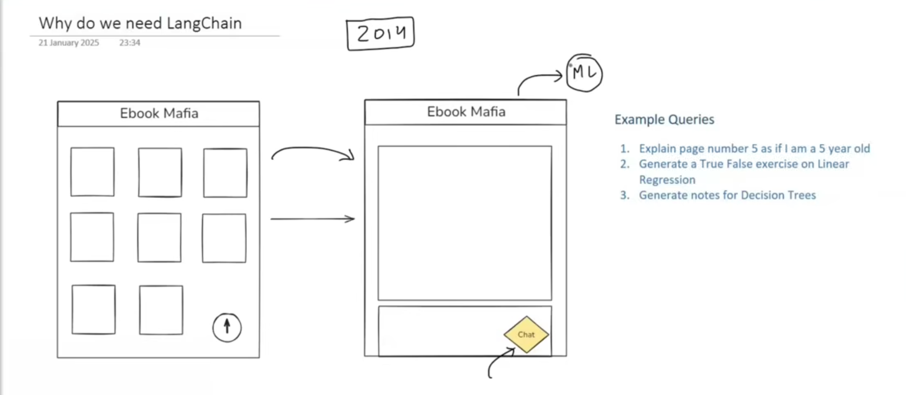
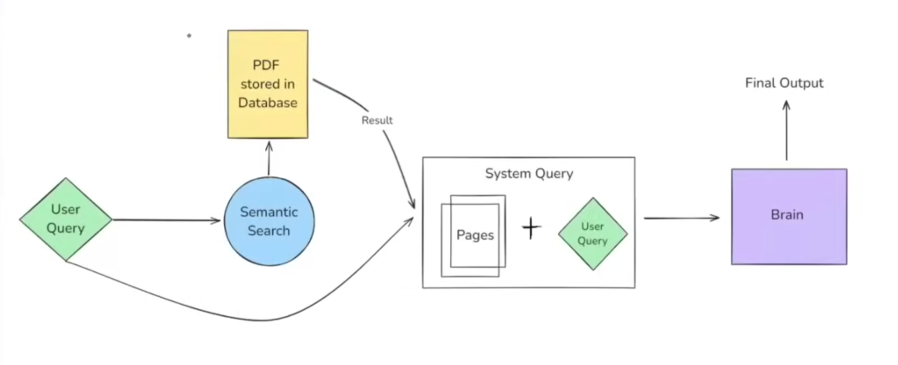
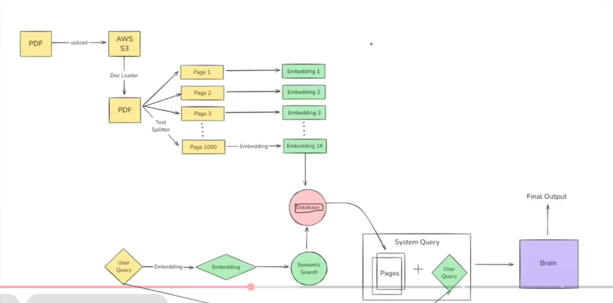

# What is LangChain?

LangChain is an open source framework that helps in building LLM based applications. It provides modular components and end-to-end tools that help developers build complex AI applications, such as chatbots, question-answering systems, retrieval-augmented generation (RAG), autonomous agents, and more.

1. Supports all the major LLMs.
2. Simplifies developing LLM based applications.
3. Integrations available for all major tools.
4. Open source/Free/Actively developed.
5. Supports all major GenAI use cases.

## Why do we need LangChain?

I can read any book, and with the help of an AI chatbot, I can ask smart, contextual questions like:

`Example Queries:`
1. Explain page number 5 as if I am a 5 year old
2. Generate notes for Decision Tree

## Benifits

1. Concepts of chains
2. Model Agnostic Development
3. Complete ecosystem
4. Memory and state handling

## What can you build?

1. Conversational chatbots
2. AI Knowledge Assistants
3. AI Agents
4. Workflow Automation
5. Summarization/Research Helpers

