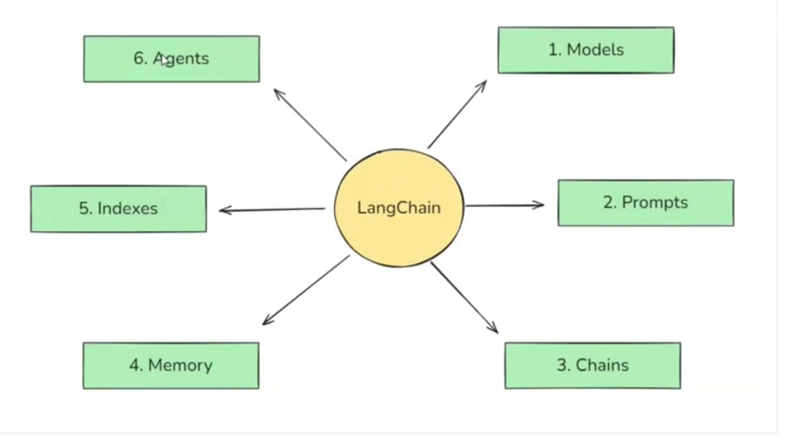
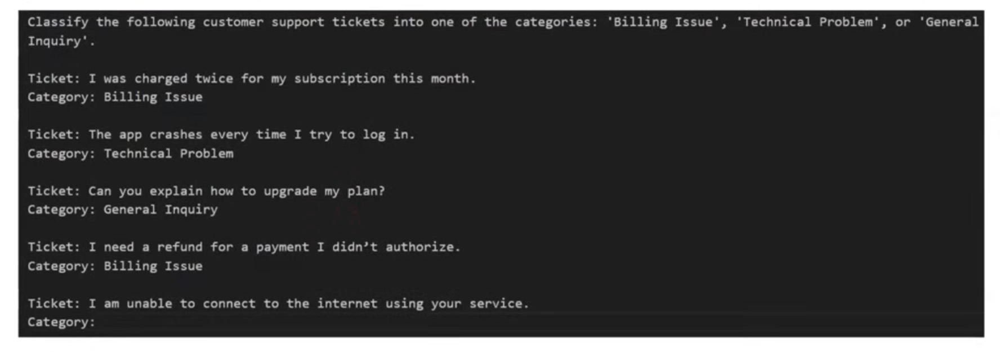
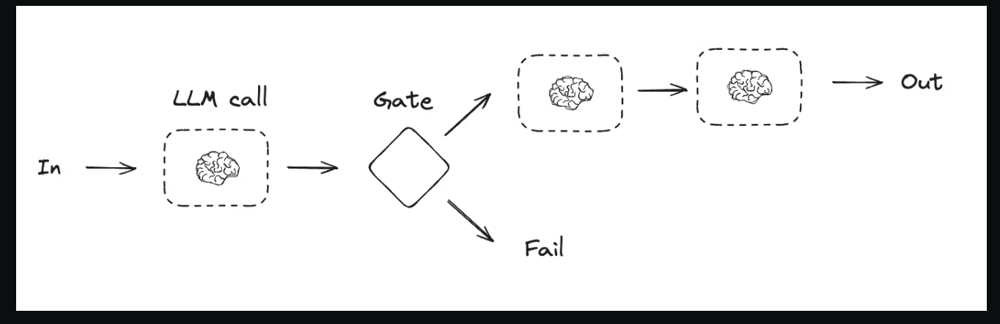
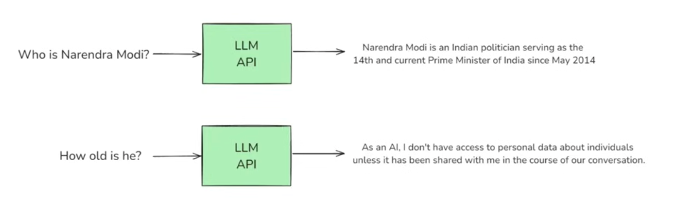
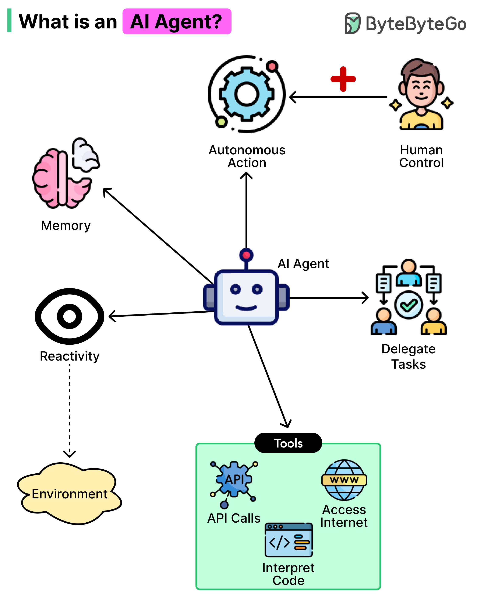

# LangChain Components



## 1. Models
In LangChain `models` are the core interfaces through which you interact with AI models.

### Connect with OpenAI (Without LangChain)

```
from openai import OpenAI
client = OpenAI()

completion = client.chat.completions.create(
    model = "gpt-4o-mini",
    message = [
        { "role": "system", "content": "You are a helpful assistant" },
        {
            "role": "user:,
            "content": "Write a haiku about recursion in programming"
        }
    ]
)
print(completions.choices[0].message)
```

### Connect with Claude (Without LangChain)

```
import anthropic

client = anthropic.Anthropic()

message = client.messages.create(
    model="claude-3-5-sonnet-20241022",
    max_token=1000,
    temperature=0,
    system="You are a world class poet. Respond only with short poems.",
    messages=[
        {
            "role": "user",
            "content": [
                "type": "text",
                "text": "Why is the ocean salty?"
            ]
        }
    ]
)
print(message.content)
```

### Connect with OpenAI (With LangChain)
```
from langchain_openai import ChatOpenAI
from dotenv import load_dotenv

load_dotenv()

model = ChatOpenAI(model='gpt-4', temperature=0)

result = model.invoke("Now divide the result py 1.5")

print(result.content)
```

### Connect with Claude (With LangChain)
```
from langchain_anthropic import ChatAnthropic
from dotenv import load_dotenv

load_dotenv()

model = ChatAnthropic(model='claude-3-opus-20240229')

result = model.invoke("Hi How are you")

print(result.content)
```


### LangChain Provies two types of Model

#### 1. Language Model (LLM) in LangChain
A model that takes text (prompt) as input and returns generated text as output.

It is mainly used for tasks like question answering, summarization, reasoning, and text generation.

#### 2. Embedding Model in LangChain
A model that takes text as input and converts it into a vector (embedding).

These vectors are used for semantic search, similarity matching, retrieval (RAG), and clustering.


## 2. Prompts

### 2.1 Dynamic & Reusable Prompts

```
from langchain_core.prompts import PromptTemplate

prompt = PromptTemplate.from_template('Summarize {topic} in (emotion} tone')

print(prompt.format(topic='Cricket', length= 'fun'))
```

### 2.2 Role-Based Prompts

```
# Define the ChatPromptTemplate using from_template

chat_prompt = ChatPromptTemplate.from_template([
    ("system", "Hi you are a experienced (profession)"),
    ("user", "Tell me about (topic)")
])

# Format the prompt with the variable

formatted_messages = chat_prompt.format_messages(profession="Doctor",topic="Viral Fever")
```

### 2.3 Few Shot Prompting
```
examples = [
{ "input": "I was charged twice for my subscription this month.", "output": "Billing Issue" },

{ "input": "The app crashes every time I try to 1og in.", "output": "Technical Problem" },

{ "input": "Can you explain how to upgrade my plan?", "output": "General Inquiry" },

{ "input": "I need a refund for a payment I didn't authorize.", "output": "Billing Issue" }
]
```

```
# Step 2: Create an example template

example_template = """
Ticket: {input}
Category: {output}
```

```
# Step 3: Build the few-shot prompt template

few_shot_prompt = FewShotPromptTemplate(
    examples=examples,

    example_prompt=PromptTemplate(input_variables=["input", "output"], template=example_template),

    prefix="Classify the following customer support tickets into one of the categories: 'Billing Issue', 'Technical Problem', or 'General Inquiry.' -\n\n" ,

    suffix="\nTicket: {user_input}\nCategory:",

    input_variables=["user_input"],
)
```



## 3. Chains

Prompt chaining is when each LLM call processes the output of the previous call. It’s often used for performing well-defined tasks that can be broken down into smaller, verifiable steps. Some examples include:

- Translating documents into different languages
- Verifying generated content for consistency




## 4. Memory

LLM API calls are stateless.



### Mostly Used Memory
- `ConversationalBufferMemory`: Stores a transcript of recent messages. Great for short charts but can grow large quickly.
- `ConversationalBufferMemory`: Only keeps the last `N` interactions to avoid excessive token usage. 
- `Summarizer-Based Memory`: Periodically summarizes older chat segments to keep a condensed memory footprint.
- `Custom Memory`: For advanced use cases, you can store specialized state (e.g., the user's preferences or key facts about them) in a custom memory class. 

## 5. Indexes

Indexes connect your application to external knowledge - such as PDF, websites or databases.

There are four major pointers in Indexes:

1. Document Loader
2. Text Splitter
3. Vector Store
4. Retrivers


## 6. Agents

An AI Agent is a software system that can observe, think, decide, and act to complete tasks automatically using Artificial Intelligence. Think of it like a smart digital assistant that doesn’t just answer questions — it can actually perform work for you.

`Example`:

If ChatGPT only answers your questions → it’s mainly a chatbot

If it can book tickets, send emails, analyze data, and make decisions automatically → it becomes an AI Agent.

